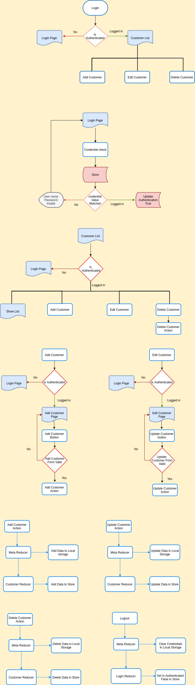

## INTRODUCTION

This project was created when learning the NGRX library, I used `@ngrx/store`, `@ngrx/store-devtools` for managing the project state. I used Router library for Manage the component navigation and Guards for handle the component security and I used local storage to save and retrieve project state.

## Flow Chart

## Components

The following four Components are created for this project

`Login Component`  |
`CustomerList Component`  |
`CustomerAdd Component`  |
`CustomerEdit Component`  |
`Navbar Component`

## Login Component

The following files are created for Implement the NGRX store features in LOGIN COMPONENT
`Login.action.ts` |
`Login.reducer.ts` |
`login.selector.ts`|
`login.state.ts`|

## Login.state.ts

This file exports the model of login state and Initial state with credentials

## Login.action.ts

Here I created two actions `login` and `logout`. 

## Login.reducer.ts

Login reducer handle the Login.actions. On `login` action check the credential values with login.state values, if it is matched then it changes the isAuthenticated tag to true.
On `logout` action it changes the Is Authenticated tag to false.

## Login.selector.ts

Selectors used to get data from the store. Here isAuth selector is used to get the current state isAuthenticated value from the store.

## Customers

For handling the customer state the following files are created. 
`Customer.state.ts` |
`Customer.action.ts`|
`Customer.reducer.ts`|
`Customer.selector.ts`

## Customer.state.ts

It has the model of customer data and exports the initial state of customers with empty array.

## Customer.action.ts

In this file I created three actions `addCustomer`,`deleteCustomer`,`modifyCustomer`.
For addCustomer action we pass the Customer details, onDeleteCustomer we pass the customerID, onModifyCustomer we pass the modified customer data.

## Customer.reducer.ts

Customer reducer created for handle the customer actions. On `addCustomer` we get the customer details as props and saved into the store. `onDeleteCustomer` we get the Id of the Customer Data and we remove the customer using the customer id. `onModifyCustomer` we get the modified customer data
as props and we updated the customer data. 

## Customer.selector.ts

getCustomerState selector is created for get all the customers from the store.

## Meta Reducer

Meta reducers works between the action and reducer. Here i created `storage.metareducer.ts` for perform some operations between the action and reducer.
## Storage.metareducer.ts

In this file we get the state and action as parameter also we can get the next state 
by reducing the state and action. we can get the action type for every actions. Using the action type we can identify which action is performed, for every action the state is going to be changed. Here i get the state changes and updates into local storage. When we logged in for the first time the local storage will returns empty value for that time we should set the localstorage with initialstate. If the localstorage has any data then we should get and return the local storage data on login success.

## Errors Faced

## 1
object cannot parse the null value
## solution
we should put the empty state structure in the local storage on the first time login when no data in the local storage.
## 2
when reload the page navigate to login
## solution
After login success we should get the authenticated token from the local storage. That means if we have isAuthenticated true in the localStorage we never show the login page.
## 3 
Argument of type 'string | null' is not assignable to parameter of type 'string'.
  Type 'null' is not assignable to type 'string'  
    token = JSON.parse(localStorage.getItem("customer")) 
## solution
we should give the default value or empty value for the function or variable.  
    token = JSON.parse(localStorage.getItem("customer") || '{}') 

